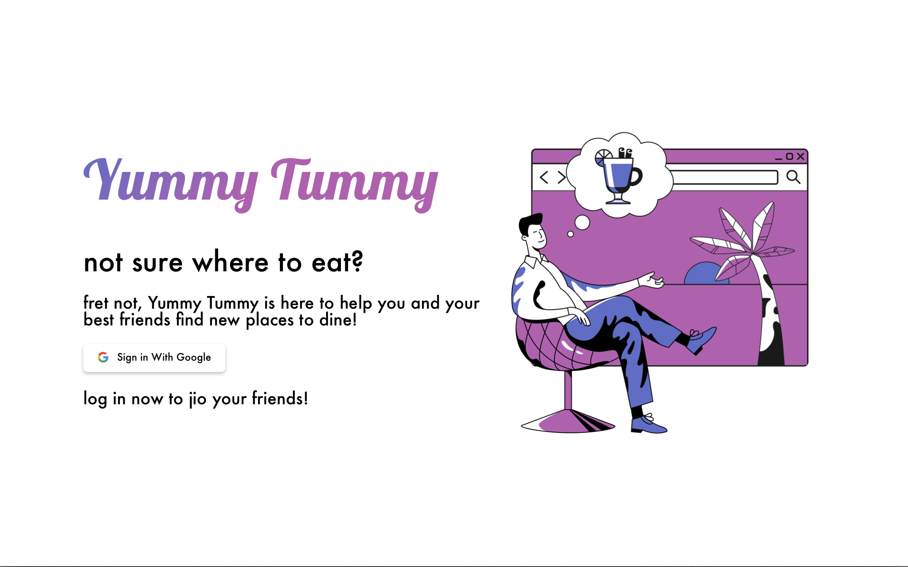
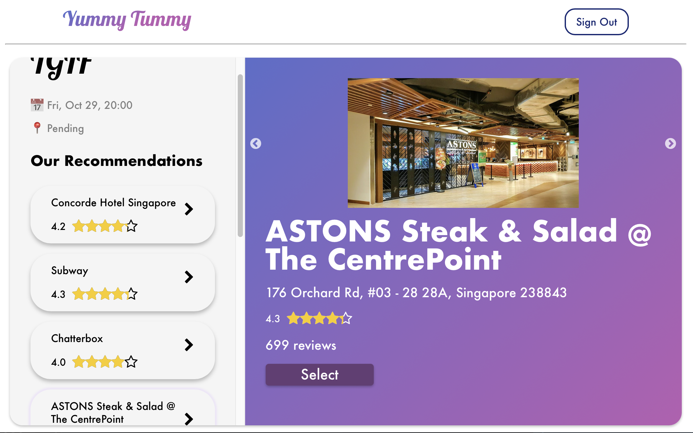
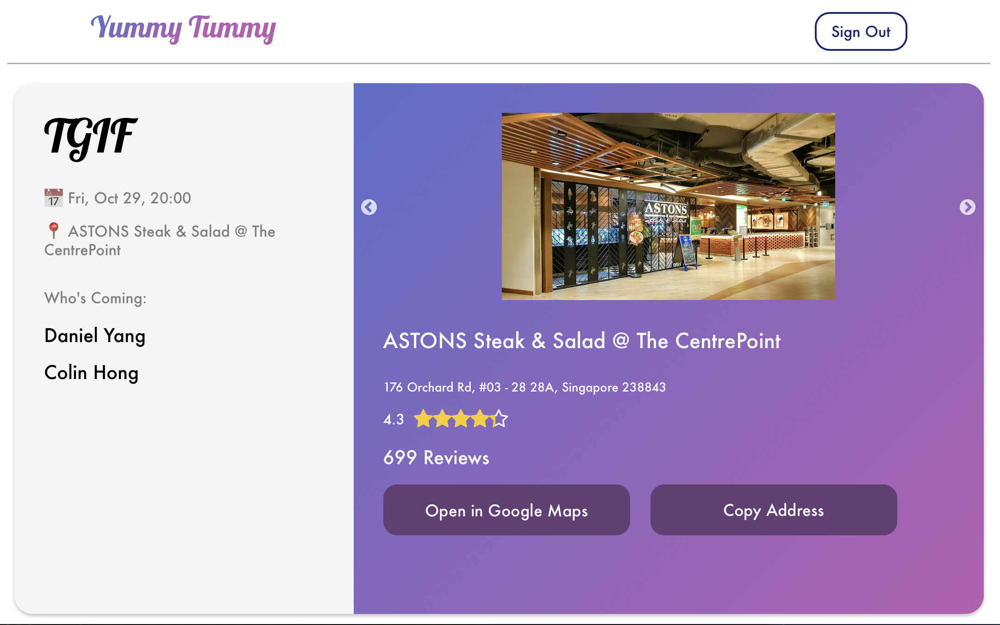

<div id="top"></div>


<!-- PROJECT SHIELDS -->
<!--
*** I'm using markdown "reference style" links for readability.
*** Reference links are enclosed in brackets [ ] instead of parentheses ( ).
*** See the bottom of this document for the declaration of the reference variables
*** for contributors-url, forks-url, etc. This is an optional, concise syntax you may use.
*** https://www.markdownguide.org/basic-syntax/#reference-style-links
-->
[![Forks][forks-shield]][forks-url]
[![Stargazers][stars-shield]][stars-url]
[![Issues][issues-shield]][issues-url]


<!-- PROJECT LOGO -->
<br />
<div align="center">
  <a href="https://github.com/matthew-chua/YummyTummy">
    
  </a>

  <h3 align="center">Yummy Tummy</h3>

  <p align="center">
    Not sure where to eat? Fret not, Yummy Tummy is here to help you and your best friends find new places to dine!
    <br />
    <a href="https://docs.google.com/document/d/1PGXFMxOzo0Xzxs_QLbm7PyQhAGxLvLaw/edit#heading=h.6a1ol73idkep"><strong>Explore the docs »</strong></a>
    <br />
    <br />
    <a href="https://github.com/matthew-chua/YummyTummy">View Demo</a>
    ·
    <a href="https://github.com/matthew-chua/YummyTummy/issues">Report Bug</a>
    ·
    <a href="https://github.com/matthew-chua/YummyTummy/issues">Request Feature</a>
  </p>
</div>


<!-- TABLE OF CONTENTS -->
<details>
  <summary>Table of Contents</summary>
  <ol>
    <li>
      <a href="#about-the-project">About The Project</a>
      <ul>
        <li><a href="#built-with">Built With</a></li>
      </ul>
    </li>
    <li>
      <a href="#getting-started">Getting Started</a>
      <ul>
        <li><a href="#prerequisites">Prerequisites</a></li>
        <li><a href="#installation">Installation</a></li>
      </ul>
    </li>
    <li><a href="#usage">Usage</a></li>
<!--     <li><a href="#roadmap">Roadmap</a></li> -->
    <li><a href="#contributing">Contributing</a></li>
<!--     <li><a href="#license">License</a></li> -->
<!--     <li><a href="#contact">Contact</a></li> -->
    <li><a href="#acknowledgments">Acknowledgments</a></li>
  </ol>
</details>


<!-- ABOUT THE PROJECT -->
## About The Project
[![Yummy Screen Shot][product-screenshot](https://yummytum.herokuapp.com)

YummyTummy is a web app that is used to discover new eateries in Singapore. This system is designed as a comprehensive platform for users and to provide them with an accessible way of organizing and viewing events. It also enables Host and Invitees to look for  new places to eat. With the use of the Google Maps API, the application also provides users with immediate access to information about the suggested eateries as well as the selected eatery. The Google Maps API is also used to generate said eateries. 

<p align="right">(<a href="#top">back to top</a>)</p>


### Built With

* [React.js](https://reactjs.org/)

<p align="right">(<a href="#top">back to top</a>)</p>


<!-- GETTING STARTED -->
## Getting Started

To get a local copy up and running follow these simple example steps.

### Getting Started with Create React App

This project was bootstrapped with [Create React App](https://github.com/facebook/create-react-app).

#### Available Scripts

In the project directory, you can run:

##### `yarn start`

Runs the app in the development mode.\
Open [http://localhost:3000](http://localhost:3000) to view it in the browser.

The page will reload if you make edits.\
You will also see any lint errors in the console.

##### `yarn test`

Launches the test runner in the interactive watch mode.\
See the section about [running tests](https://facebook.github.io/create-react-app/docs/running-tests) for more information.

##### `yarn build`

Builds the app for production to the `build` folder.\
It correctly bundles React in production mode and optimizes the build for the best performance.

The build is minified and the filenames include the hashes.\
Your app is ready to be deployed!

See the section about [deployment](https://facebook.github.io/create-react-app/docs/deployment) for more information.

##### `yarn eject`

**Note: this is a one-way operation. Once you `eject`, you can’t go back!**

If you aren’t satisfied with the build tool and configuration choices, you can `eject` at any time. This command will remove the single build dependency from your project.

Instead, it will copy all the configuration files and the transitive dependencies (webpack, Babel, ESLint, etc) right into your project so you have full control over them. All of the commands except `eject` will still work, but they will point to the copied scripts so you can tweak them. At this point you’re on your own.

You don’t have to ever use `eject`. The curated feature set is suitable for small and middle deployments, and you shouldn’t feel obligated to use this feature. However we understand that this tool wouldn’t be useful if you couldn’t customize it when you are ready for it.

#### Learn More

You can learn more in the [Create React App documentation](https://facebook.github.io/create-react-app/docs/getting-started).

To learn React, check out the [React documentation](https://reactjs.org/).


### Prerequisites

* yarn
  ```sh
  yarn install
  ```

<!-- ### Installation

1. Get a free API Key at [https://example.com](https://example.com)
2. Clone the repo
   ```sh
   git clone https://github.com/your_username_/Project-Name.git
   ```
3. Install NPM packages
   ```sh
   npm install
   ```
4. Enter your API in `config.js`
   ```js
   const API_KEY = 'ENTER YOUR API';
   ```

<p align="right">(<a href="#top">back to top</a>)</p> -->


<!-- USAGE EXAMPLES -->
## Usage

_For more examples, please refer to the [Documentation](https://example.com)_

1. On the Landing Page, Sign In with Google to start using YummyTummy. 

2. You will be greeted with the Dashboard where you can view your Upcoming Events and Previous Events.\n
3. To create a new event, click "Jio Your Friends".

4. Be sure to fill in all the Event Details before creating the event with your location (with current location or manually entering where you are currently at).

5. Copy the Invite URL and share it with your friends!

6. You may edit the details of the event on that Event Page too.To delete and event, click the Delete button.

7. Sit back, relax and wait for your friends to join the event.
8. Satisfied with who's coming? Click the Search button to find the nearest food places for all!\n
9. Choose from a list of curated food places for you to meet!

10. Your friends will now see your chosen meeting location on their Dashboard.


<p align="right">(<a href="#top">back to top</a>)</p>


<!-- ROADMAP -->
<!-- ## Roadmap

- [x] Add Changelog
- [x] Add back to top links
- [] Add Additional Templates w/ Examples
- [] Add "components" document to easily copy & paste sections of the readme
- [] Multi-language Support
    - [] Chinese
    - [] Spanish

See the [open issues](https://github.com/othneildrew/Best-README-Template/issues) for a full list of proposed features (and known issues).

<p align="right">(<a href="#top">back to top</a>)</p> -->


<!-- CONTRIBUTING -->
<!-- ## Contributing

Contributions are what make the open source community such an amazing place to learn, inspire, and create. Any contributions you make are **greatly appreciated**.

If you have a suggestion that would make this better, please fork the repo and create a pull request. You can also simply open an issue with the tag "enhancement".
Don't forget to give the project a star! Thanks again!

1. Fork the Project
2. Create your Feature Branch (`git checkout -b feature/AmazingFeature`)
3. Commit your Changes (`git commit -m 'Add some AmazingFeature'`)
4. Push to the Branch (`git push origin feature/AmazingFeature`)
5. Open a Pull Request

<p align="right">(<a href="#top">back to top</a>)</p> -->


<!-- LICENSE -->
<!-- ## License

Distributed under the MIT License. See `LICENSE.txt` for more information.

<p align="right">(<a href="#top">back to top</a>)</p> -->


<!-- CONTACT -->
<!-- ## Contact

Your Name - [@your_twitter](https://twitter.com/your_username) - email@example.com

Project Link: [https://github.com/matthew-chua/YummyTummy](https://github.com/matthew-chua/YummyTummy)

<p align="right">(<a href="#top">back to top</a>)</p>
 -->


<!-- ACKNOWLEDGMENTS -->
## Acknowledgments

<!-- * [Choose an Open Source License](https://choosealicense.com) -->
* [Icons8](https://icons8.com/l/animations/)
* [Undraw](https://undraw.co)
* [FontAwesome](https://fontawesome.com)

<p align="right">(<a href="#top">back to top</a>)</p>


<!-- MARKDOWN LINKS & IMAGES -->
<!-- https://www.markdownguide.org/basic-syntax/#reference-style-links -->
[contributors-shield]: https://img.shields.io/github/contributors/othneildrew/Best-README-Template.svg?style=for-the-badge
[contributors-url]: https://github.com/matthew-chua/graphs/contributors
[forks-shield]: https://img.shields.io/github/forks/othneildrew/Best-README-Template.svg?style=for-the-badge
[forks-url]: https://github.com/matthew-chua/YummyTummy/network/members
[stars-shield]: https://img.shields.io/github/stars/othneildrew/Best-README-Template.svg?style=for-the-badge
[stars-url]: https://github.com/matthew-chua/YummyTummy/stargazers
[issues-shield]: https://img.shields.io/github/issues/othneildrew/Best-README-Template.svg?style=for-the-badge
[issues-url]: https://github.com/matthew-chua/YummyTummy/issues
[license-shield]: https://img.shields.io/github/license/othneildrew/Best-README-Template.svg?style=for-the-badge
[license-url]: https://github.com/matthew-chua/master/LICENSE.txt
[product-screenshot]: https://github.com/matthew-chua/master/ReadMeAssets/LandingPage.png
